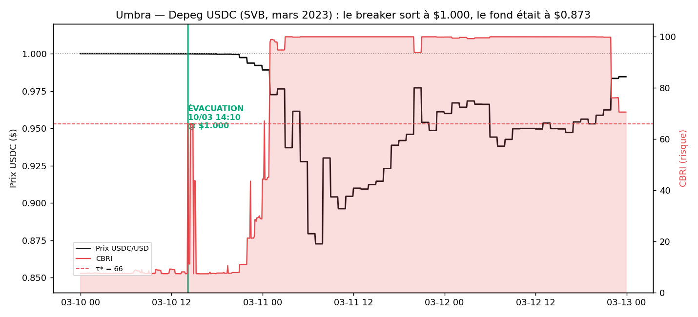
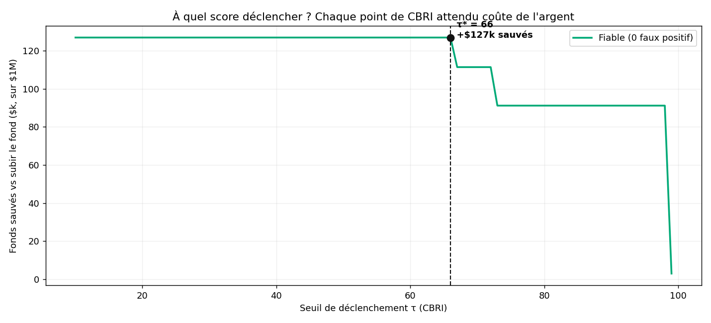
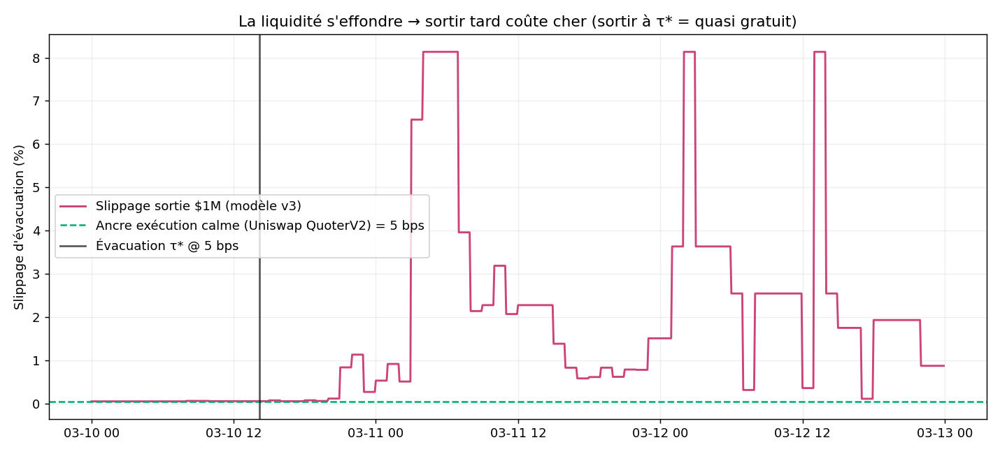

# 🛑 CircuitBreaker.ai

> **Le disjoncteur financier autonome de la DeFi.**
> Détecte les risques systémiques (crises de liquidité, depegs) via un modèle quantitatif, et évacue automatiquement les fonds des utilisateurs vers un stablecoin sûr — **avant** que la pool ne s'effondre.

🏆 *ETH Global Lisbon 2026 — Tracks : The Graph · 0G* · (exécution Uniswap v3)

---

## 🎯 Le problème

Quand une pool DeFi part en crise (depeg, fuite de liquidité), l'utilisateur moyen s'en rend compte **trop tard** : le temps de comprendre, la liquidité s'est évaporée et le slippage de sortie a explosé. Les pertes de mars 2023 (depeg USDC), Terra/UST, stETH… se comptent en **milliards**.

## 💡 La solution

Un **disjoncteur** on-chain qui surveille en continu un **Score de Risque (CBRI, 0→100)** et déclenche une évacuation d'urgence dès que le seuil optimal `τ*` est franchi.

- **Modèle quant (CBRI)** — 3 signaux agrégés en *Noisy-OR* : vitesse de fuite de liquidité, déséquilibre de pool, divergence de prix.
- **Seuil optimal `τ*`** — prouvé par backtesting sur de vrais crashs : le point exact qui **maximise les fonds sauvés nets**.
- **Business model aligné** — *success fee* uniquement sur la perte évitée. On ne gagne que si l'utilisateur gagne.

## 🏗️ Architecture & Sponsors

| Couche | Techno | Rôle |
|---|---|---|
| **Données** 🏆 | **The Graph** | Historique + temps réel des pools Uniswap v3 (swaps tick-level, liquidité, prix) |
| **IA / Infra** 🏆 | **0G** | Stockage & traçabilité décentralisée du modèle et des scores de risque |
| **Exécution** | **Uniswap v3** | Swap d'évacuation on-chain direct (QuoterV2 + SwapRouter02, sans API) |

*🏆 = tracks visés. Uniswap = infra data + exécution (on ne postule pas à leur track).*

> **Rigueur backtest vs prod :** le backtest **simule l'exécution contre la liquidité on-chain historique** (physique réelle de la pool via The Graph) ; l'exécution live lit un **quote Uniswap QuoterV2 on-chain** puis swap via SwapRouter02. On price le passé par la physique, on exécute le présent au prix réel de la pool.

## 📂 Structure

```
circuitbreaker-ai/
├── quant-backtest/     # Python — le cerveau (modèle CBRI + backtesting)
└── live-execution/     # TypeScript — les muscles (exécution Uniswap + traçabilité 0G)
```

## 📊 Résultat backtest — Depeg USDC (SVB, 11 mars 2023)

Rejoué sur **48 066 swaps réels** ($5,57 Md de volume) extraits via The Graph, pour une **position de $1M USDC**.

| | |
|---|---|
| **τ\* optimal** | **66 / 100** (plateau optimal [10–66], 0 faux positif en marché calme) |
| **Déclenchement** | 10/03 14:10 UTC — *17h avant le fond*, USDC encore à **$1.0000** |
| **Fond du depeg (sans agir)** | $0.8726 → position à **$872 595** |
| **💰 Fonds sauvés** | **$126 900 (12,7 %)** — success fee 10 % = **$12 690** |

**Le coût d'attendre** (chaque point de CBRI attendu = de l'argent perdu) :

| Seuil τ | Sortie | Prix | Slippage | Sauvés |
|---|---|---|---|---|
| **10–66 (τ\*)** | 10/03 14:10 | **$1.0000** | 5 bps | **$126.9k** |
| 67–72 | 11/03 00:15 | $0.9892 | 53 bps | $111.4k |
| 73–98 | 11/03 01:00 | $0.9726 | 91 bps | $91.1k |
| 99 | 11/03 03:00 | $0.9371 | **657 bps** | $2.9k |

> La liquidité active de la pool USDC/USDT s'effondre de **×23 000 000** pendant le crash → le slippage de sortie explose. Sortir à τ\* = quasi gratuit ; attendre la confirmation = mur de liquidité.





## 🧮 Le modèle : CBRI (CircuitBreaker Risk Index)

3 sous-signaux normalisés par sigmoïde, agrégés en **Noisy-OR pondéré** (un disjoncteur saute si *un seul* signal vire au rouge) :

```
CBRI = 100 · (1 − ∏ᵢ (1 − wᵢ·sᵢ))        sᵢ = σ(αᵢ·(xᵢ − seuilᵢ))
```

| Signal | Mesure | Rôle | Source |
|---|---|---|---|
| **Fuite de liquidité** | vitesse de retrait LP (mints−burns / TVL·h) | **alerte précoce** | swaps + mints/burns |
| **Order-Flow Imbalance** | unidirectionnalité du flux | diagnostic (w=0 ici, non-discriminant) | swaps |
| **Divergence / depeg** | \|1 − prix USDC\| | **confirmation** | pool stable USDC/USDT |

## 🔒 Traçabilité décentralisée (0G)

Un disjoncteur qu'on doit croire aveuglément ne vaut rien. Chaque score de risque **et le modèle exact qui l'a produit** sont figés dans une *attestation*, dont le **root hash Merkle 0G** est publié sur le stockage décentralisé **0G**. N'importe qui peut re-télécharger l'artefact et vérifier le hash → scoring **auditable et infalsifiable**.

```bash
cd live-execution && npm run publish0g
# 🌳 0G Storage root hash : 0x7e30144d58abdbd6963fa00bad42b13edaa564eec958a2395bc42c010e1440e5
```

> Le root hash 0G se calcule **en local** (aucun wallet requis). L'upload réel sur 0G testnet ne nécessite qu'un wallet financé (faucet).

## 🚀 Démarrage

```bash
cp .env.example .env      # THEGRAPH_API_KEY (requis)  ·  RPC_URL (optionnel, défaut public)
cd quant-backtest && pip install -r requirements.txt
python thegraph_client.py   # ① extraction des données du crash (The Graph)
python features.py          # ② calcul du CBRI
python backtest.py          # ③ backtest τ* + figures

cd ../live-execution && npm install
npm run publish0g           # ④ ancrage modèle+scores sur 0G (traçabilité)
npm run demo                # ⑤ replay du depeg → le breaker évacue via Uniswap v3
```

## 🧪 Tests

**29 tests unitaires** couvrant le cœur logique (modèle, slippage, sélection de τ*, exécution) :

```bash
# Quant (Python) — 21 tests : sigmoïde, prix v3, Noisy-OR, slippage, τ*, fonds sauvés
cd quant-backtest && pip install -r requirements-dev.txt && python -m pytest

# Exécution (TS) — 8 tests : conversion position, slippage bps, minOut, parsing feed
cd live-execution && npm test
```

---

*MVP hackathon — architecture publique assumée (pas de couche privacy/MEV sur ce périmètre).*
